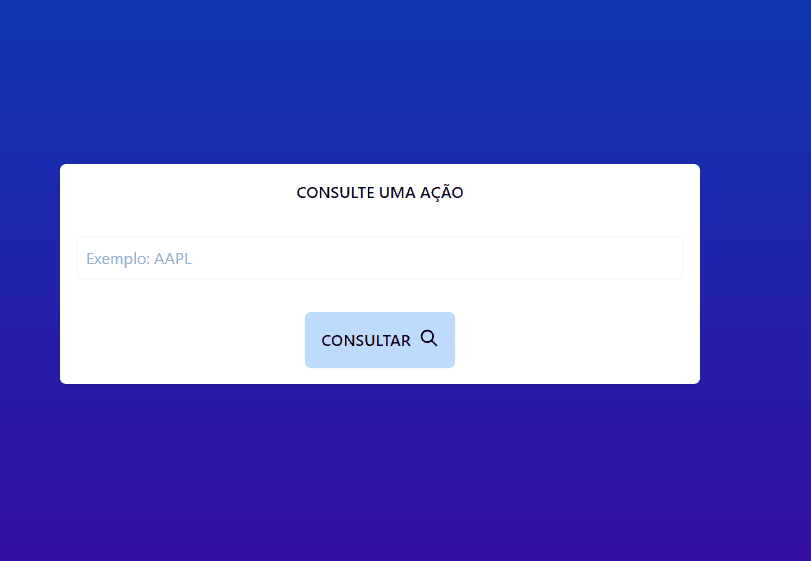
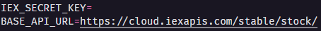
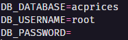
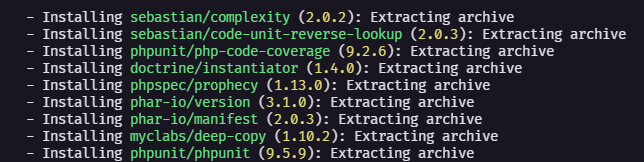
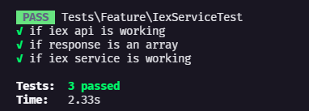
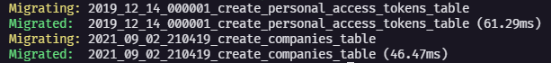
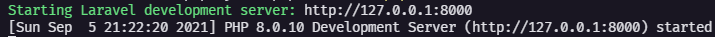

<h1 align="center"> AcPrices - Consulte o valor de ações </h1>

<a href="#sobre">Sobre</a> •
<a href="#tecnologias">Tecnologias</a> •
<a href="#passo-a-passo">Passo a passo</a> 

# Sobre

AcPrices é uma simples aplicação que exibe o valor de ações através de chamdas de API da <a href="https://iexcloud.io/docs/api/" target="_blank">IEX</a>.

# Tecnologias
• <a href="https://www.php.net/" target="_blank">PHP 8.0</a> 

• <a href="https://laravel.com/" target="_blank">Laravel Framework</a>

• <a href="https://www.mysql.com/" target="_blank">MySQL</a>

• <a href="https://laravel-livewire.com/" target="_blank">Livewire</a>

• <a href="https://tailwindcss.com/" target="_blank">Tailwind CSS</a>

# Passo a passo

## 01 - Criar uma conta na <a href="https://iexcloud.io/docs/api/">IEX</a> e inserir o SECRET TOKEN em IEX_SECRET_KEY do arquivo .env.

## 02 - Criar o banco de dados e preencher as configurações no arquivo .env

## 03 - Executar o comando **composer update** na pasta do projeto.

## 04 - Executar os testes da aplicação com o comando **php artisan test**.

## 05 - Executar as migrations com o comando **php artisan migrate**.

## 06 - Rodar o projeto com o comando **php artisan serve** para visualização.

